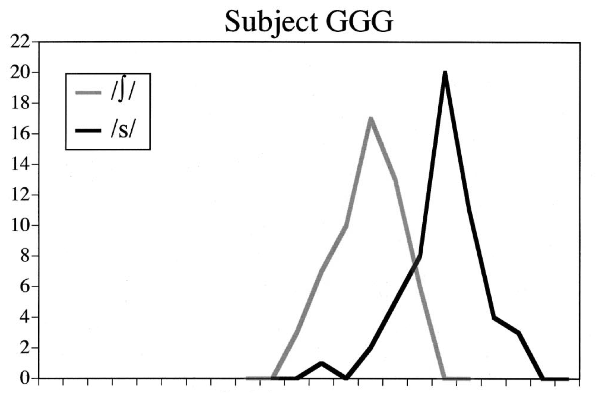
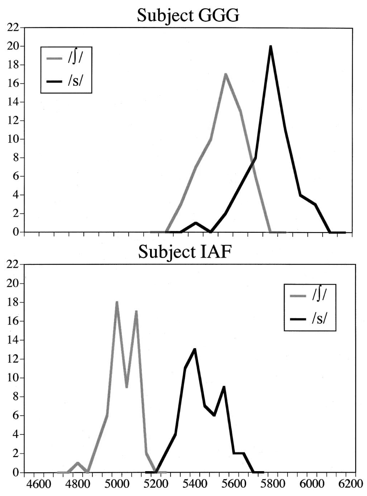
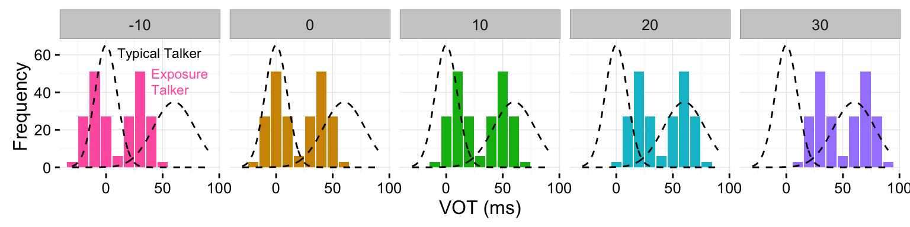
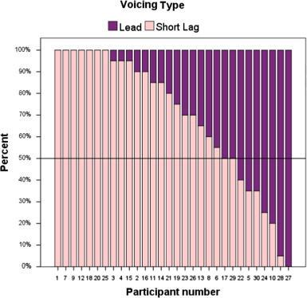

## Thanks

* People:
    * Florian Jaeger
    * Andrew Watts (MTurk wizardry)
    * HLP Lab
* Funding
    * NIH NICHD R01 to TFJ and NRSA to DFK


```{r preamble, message = FALSE, warning = FALSE, error = FALSE, results='hide', echo=FALSE}

library(knitr)

opts_chunk$set(dev = 'png',
               fig.retina = 2,
               error = FALSE, warning = FALSE, message = FALSE,
               results = 'hide', echo = FALSE,
               cache = TRUE)

library(dplyr)
library(tidyr)
library(magrittr)
library(ggplot2)
library(assertthat)
library(gganimate)
library(animation)
ani.options(autobrowse = FALSE, interval = .2)

## colors!!
h_offset <- -15
scale_color_discrete <- function(...) scale_color_hue(..., h = c(0, 360) + h_offset)
scale_fill_discrete <- function(...) scale_fill_hue(..., h = c(0, 360) + h_offset)

red <- hcl(h = 0 + h_offset, c = 100, l = 65)
red_bright <- hcl(h = 0 + h_offset, c = 100, l = 80)

blue <- hcl(h = 240 + h_offset, c = 100, l = 65)

green <- hcl(h = 120 + h_offset, c = 100, l = 65)

## FRom the gganimate github readme: a hacked-together gif animation hook:
## https://github.com/dgrtwo/gganimate/blob/master/README.Rmd

opts_knit$set(animation.fun = function(x, options, format = "gif") {
  x = c(knitr:::sans_ext(x), knitr:::file_ext(x))
  fig.num = options$fig.num
  format = sub("^[.]", "", format)
  fig.fname = paste0(sub(paste0(fig.num, "$"), "*", x[1]), 
                     ".", x[2])
  mov.fname = paste0(sub(paste0(fig.num, "$"), "", x[1]), ".", 
                     format)

  # order correctly
  figs <- Sys.glob(fig.fname)
  figs <- figs[order(as.numeric(stringr::str_match(figs, paste0("(\\d+)\\.", x[2]))[, 2]))]

  animation::im.convert(figs, output = mov.fname)

  if (is.null(options$out.width) && is.null(options$out.height)) {
    sprintf("", options$label, paste0(opts_knit$get("base.url"), mov.fname))
  } else {
    extra_options <- paste(ifelse(is.null(options$out.height),
                                          '',
                                          sprintf('height="%s"', options$out.height)),
                           ifelse(is.null(options$out.width),
                                          '',
                                          sprintf('width="%s"', options$out.width)))
    sprintf('',
            paste0(opts_knit$get("base.url"), mov.fname),
            options$label,
            extra_options)
  }

})

## force png and fig.retina=1 for fig.show='animate'
opts_hooks$set(fig.show = function(options) {
  if (options$fig.show == 'animate') {
    options$dev <- 'png'
    options$fig.retina <- 1
  }
  options
})


theme_set(theme_bw() +
            theme(panel.border = element_blank())
          )

## data and helper functions
## devtools::install_github('kleinschmidt/phonetic-sup-unsup')
require(supunsup)

data <- supunsup::supunsup_clean %>%
  filter(supCond == 'unsupervised') %>%
  mutate(trueCat = respCategory,
         subjNum = as.numeric(factor(subject)),
         trueCatNum = as.numeric(trueCat),
         respCatNum = as.numeric(respCat))

data_by_subject <- data %>%
  group_by(subject, bvotCond, vot) %>%
  summarise(prob_p = mean(respP))

# correspondence between subject ids and numbers from model
subjects <-
  data %>%
  mutate(subject_num = as.numeric(factor(subject))) %>%
  group_by(subject, bvotCond, subject_num) %>%
  summarise() %>%
  arrange(subject_num)


prior_stats <- supunsup::prior_stats %>%
  filter(source == 'kronrod2012')

exposure_stats <- data %>%
  group_by(bvotCond, category=trueCat) %>%
  summarise(mean=mean(vot), sd=sd(vot))

sd_noise = sqrt(82)

stats_to_lhood <- function(stats, noise_sd=sd_noise, xlim=c(-30, 90)) {
  stats %>%
    group_by(category, mean, sd) %>%
    do(data.frame(vot=seq(xlim[1], xlim[2], 0.5))) %>%
    ungroup() %>%
    mutate(lhood = dnorm(vot, mean, sqrt(sd^2 + noise_sd^2))) %>%
    select(-mean, -sd)
}


```

# Variation <br /><span class="fragment">is a __problem__ for speech perception</span>

<div class="notes">
* This is a conference about variation
* I'm going to talk about it from the point of view of speech __perception__, where it's typically thought of as a __problem__.
</div>

---

<div class="sidebyside">


```{r newman-classification-curves-one, fig.width=4, fig.height=2.6, out.width="40%"}

x_range <- c(4600, 6200)

newmans <- data_frame(Talker = c('GGG', 'IAF'),
                      boundary = c(5750, 5200),
                      slope = -c((5325-5167) / (0.5*(654^2+781^2)),
                                (5414-5004) / (0.5*(684^2+982^2))))

curves <- newmans %>% group_by(Talker) %>%
  do(data_frame(x = seq(x_range[1], x_range[2]),
                p = 1 / (1 + exp((x-.$boundary)*.$slope*32))))

curves %>%
  filter(Talker == 'GGG') %>%
  ggplot(aes(x=x, y=p, color=Talker)) +
  geom_line(size=2) +
  labs(y = 'Probability of /s/',
       x = "Primary /s/-/sh/ cue\n(Frication frequency centroid, Hz)") + 
  geom_text(data = newmans %>% filter(Talker == 'GGG'),
            aes(x=boundary, y=0.5, label = Talker),
            hjust = 1, vjust = 0, nudge_x = -50) +
  theme(legend.position='none') +
  scale_color_discrete(drop=FALSE)


```
</div>

<span class="cite">[Newman, Clouse, & Burnham, 2001]</span>

<div class="notes">
* commonly recognized! variation __within__ a talker.
* caetgories are __distributions__ of acoustic cues (or signals)
</div>

---

<div class="sidebyside">


```{r newman-classification-curves, fig.width=4, fig.height=2.6, out.width="40%"}

ggplot(curves, aes(x=x, y=p, color=Talker)) +
  geom_line(size=2) +
  labs(y = 'Probability of /s/',
       x = "Primary /s/-/sh/ cue\n(Frication frequency centroid, Hz)") + 
  geom_text(data = newmans,
            aes(x=boundary, y=0.5, label = Talker),
            hjust = 1, vjust = 0, nudge_x = -50) +
  theme(legend.position='none') +
  scale_color_discrete()


```
</div>

<span class="cite">[Newman, Clouse, & Burnham, 2001]</span>

<div class="notes">
* The problem is this: talkers differ in the distributions of acoustic cues they produce for each underlying linguistic category.
* These differences can lead to comprehension problems if you try to apply the classification strategy that worked for one talker to another talker
</div>

```{r particle-setup}


# sample a bunch of means and variances
# sample data points from one set of categories
# get log-lhood of each data point under each set of category parameters
# incrementally accumulate log-lhood

# gamma distribution parametrized by mean and sd
rgamma_meansd <- function(n, mean, sd, ...) {
  scale <- sd^2 / mean
  shape <- mean / scale
  rgamma(n, shape=shape, scale=scale, ...)
}

# sample a single prior from a base distribution
r_particle_one <- function(mu0 = c(0, 60),
                             mu_sigma = c(20, 20),
                             sigma0 = c(10, 15),
                             sigma_sigma = c(5, 5)) {
  k <- max(sapply(list(mu0, sigma0, mu_sigma, sigma_sigma), length))
  mu <- rnorm(n=k, mean=mu0, sd=mu_sigma)
  sigma <- rgamma_meansd(n=k, mean=sigma0, sd=sigma_sigma)
  n <- max(sapply(list(mu, sigma), length))
  list(mu=mu, sigma=sigma, theta=rep(1/n, n))
}
r_particle_prior <- function(n, ...) lapply(1:n, function(n, ...) r_particle_one(...), ...)


log_sum_exp <- function(x) log(sum(exp(x - max(x)))) + max(x)

# likelihood of data given particle (a mixture model)
d_particle <- function(x, p, log=FALSE) {
  log_lhood <- log_sum_exp(dnorm(x, mean=p$mu, sd=p$sigma, log=TRUE) + log(p$theta))
  if (log) {
    return(log_lhood)
  } else {
    return(exp(log_lhood))
  }
}

normalize <- function(x) x / sum(x)

# classification function from mixture particle
id_particle <- function(x, p) {
  
  # compute likelihood
  sapply(x, function(xx) normalize(dnorm(xx, mean=p$mu, sd=p$sigma, log=FALSE) * p$theta)[2])

}
#' Re-weight particles based on data
#'
#' @param x Sequence of data to update particles with (in order)
#' @param particles List of particles to update
#' @param d_part Likelihood function (called as d_part(x, p, log=TRUE)).
#'
#' @return A data_frame with columns x, x_idx (data/time index), p (particle),
#'   p_idx (particle index), lhood (log likelihood of data point under particle),
#'   lhood_cumulative (cumulative log likelihood of particle to that point) and
#'   weight (normalized particle weights at current time)
weight_particles <- function(x, particles, d_part) {

  data_frame(x) %>%
    mutate(x_idx = row_number()) %>%
    group_by(x, x_idx) %>%
    do({ data_frame(p=particles) %>% mutate(p_idx = row_number()) }) %>%
    rowwise() %>%
    mutate(lhood = d_part(x, p, log=TRUE)) %>%
    group_by(p_idx) %>%
    arrange(x_idx) %>%
    mutate(lhood_cumulative = cumsum(lhood)) %>%
    group_by(x_idx) %>%
    mutate(weight = exp(lhood_cumulative - log_sum_exp(lhood_cumulative)))

}

particles_to_lhood_df <- function(particles, x) {
  # data frame with pdf for each particle
  data_frame(p = particles) %>%
    mutate(p_idx = row_number()) %>%
    group_by(p_idx) %>%
    do({ data_frame(x_pdf = x,
                    particle_lhood = sapply(x_pdf, d_particle, p=.$p[[1]], log=FALSE),
                    particle_lhood_normalized = particle_lhood / max(particle_lhood)
                    )
    }) %>%
    ungroup()
}

particles_to_id_df <- function(particles, x) {
  data_frame(p = particles) %>%
    mutate(p_idx = row_number()) %>%
    group_by(p_idx) %>%
    do({ data_frame(x_id = x,
                    particle_id = id_particle(x = x_id, p = .$p[[1]])) })
}

plot_particles_lhood <- function(particles, x_to_plot_at, true_particle = NA) {

  particle_pdfs <- particles %>%
    particles_to_lhood_df(x = x_to_plot_at)

  particle_pdfs_marginal <- particle_pdfs %>%
    group_by(x_pdf) %>%
    summarise(marginal_lhood = mean(particle_lhood))
  

  particle_pdfs %>%
    ggplot() +
    geom_line(aes(x=x_pdf, y=particle_lhood, group=p_idx,
                  color='Hypotheses'), alpha=0.05) +
    geom_line(data=particle_pdfs_marginal,
              aes(x=x_pdf, y=marginal_lhood, color='Marginal')) +
    guides(alpha = FALSE) +
    theme_particles() +
    labs(y='') +
    scale_color_manual(breaks = c('Hypotheses', 'Marginal', 'Truth'),
                       values = c('black', red, blue),
                       guide = FALSE) ->
    p

  if (!missing(true_particle)) {
    true_lhood <- data_frame(x_pdf = x_to_plot_at,
                             lhood = sapply(x_pdf, d_particle, p=true_particle))
    lhood_range <- range(true_lhood$lhood)
    p <- p + 
      geom_line(data = true_lhood, aes(x=x_pdf, y=lhood, color='Truth')) +
      coord_cartesian(ylim = lhood_range + diff(lhood_range)*c(-0.02, 0.2))
  }

  p
}

plot_particles_id <- function(particles, x_to_plot_at, true_particle = NA) {
  particle_ids <- particles %>%
    particles_to_id_df(x = x_to_plot_at)

  particle_ids_marginal <- particle_ids %>%
    group_by(x_id) %>%
    summarise(marginal_id = mean(particle_id))
  
  particle_ids %>%
    ggplot(aes(x=x_id, y=particle_id)) +
    geom_line(alpha=0.05,
              aes(group=p_idx, color='Hypotheses')) +
    geom_line(data = particle_ids_marginal,
              aes(y = marginal_id, color='Marginal')) +
    labs(y = 'Probability of /p/') +
    theme_particles() +
    scale_color_manual(breaks = c('Hypotheses', 'Marginal', 'Truth'),
                       values = c('black', red, blue),
                       guide = FALSE) ->
    p

  if (!missing(true_particle)) {
    true_id <- data_frame(x_id = x_to_plot_at,
                          id = id_particle(x=x_id, p=true_particle))
    p <- p +
      geom_line(data = true_id, aes(y = id, color='Truth'))
  }

  p
}

plot_particle_updating <- function(x, particles,
                                   x_idx_to_plot_at = round(seq(1, length(x), length.out=11)),
                                   x_to_plot_at = seq(-30, 120),
                                   true_particle = NA) {

  weighted_particles <-
    weight_particles(x, particles, d_particle) %>%
    ungroup() %>% 
    filter(x_idx %in% x_idx_to_plot_at)

  # data frame with pdf for each particle
  particle_pdfs <- particles %>%
    particles_to_lhood_df(x = x_to_plot_at) %>%
    full_join(weighted_particles, by='p_idx')

  # for marginal pdf
  particle_pdfs_marginal <- particle_pdfs %>%
    group_by(x_idx, x_pdf) %>%
    summarise(marginal_lhood = sum(weight * particle_lhood))

  # for carpet plot of data points
  xs_before_xidx <- data_frame(x_idx = x_idx_to_plot_at) %>%
    group_by(x_idx) %>%
    do({ data_frame(x = x[1:.$x_idx]) })

  particle_pdfs %>%
    ggplot() +
    geom_line(aes(x=x_pdf, y=particle_lhood, alpha=weight, color='Hypotheses',
                  group=p_idx, frame=x_idx)) +
    geom_line(data=particle_pdfs_marginal,
              aes(x=x_pdf, y=marginal_lhood, group=x_idx, frame=x_idx,
                  color='Marginal')) +
    geom_point(data=xs_before_xidx, aes(x=x, y=0, alpha=1, frame=x_idx), shape='|') + 
    scale_color_manual(breaks = c('Hypotheses', 'Marginal', 'Truth'),
                       values = c('black', red, blue),
                       guide = FALSE) +
    scale_alpha_continuous(range=c(0.00,1)) +
    guides(alpha = FALSE) +
    theme_particles() +
    theme(axis.title.y = element_blank()) ->
    p

  # if there's a true particle, add its likelihood to the plot
  if (!is.na(true_particle)) {
    true_lhood <- data_frame(x_pdf = x_to_plot_at,
                             lhood = sapply(x_pdf, d_particle, p=true_particle))
    lhood_range <- range(true_lhood$lhood)
    p <- p + 
      geom_line(data = true_lhood, aes(x=x_pdf, y=lhood, color='Truth')) +
      coord_cartesian(ylim = lhood_range + diff(lhood_range)*c(-0.02, 0.2))
  }

  return(p)

}

plot_particle_updating_id <- function(x, particles,
                                      x_idx_to_plot_at = round(seq(1, length(x), length.out=11)),
                                      x_to_plot_at = seq(-30, 120),
                                      true_particle = NA) {
  weighted_particles <-
    weight_particles(x, particles, d_particle) %>%
    ungroup() %>% 
    filter(x_idx %in% x_idx_to_plot_at)

  particle_ids <- particles %>%
    particles_to_id_df(x = x_to_plot_at) %>%
    full_join(weighted_particles, by='p_idx')
    

  particle_ids_marginal <- particle_ids %>%
    group_by(x_id, x_idx) %>%
    summarise(marginal_id = sum(weight * particle_id))

  # for carpet plot of data points
  xs_before_xidx <- data_frame(x_idx = x_idx_to_plot_at) %>%
    group_by(x_idx) %>%
    do({ data_frame(x = x[1:.$x_idx]) })
  
  particle_ids %>%
    ggplot(aes(x=x_id, y=particle_id)) +
    geom_line(aes(group=p_idx, color='Hypotheses', frame=x_idx, alpha=weight)) +
    geom_line(data = particle_ids_marginal,
              aes(y = marginal_id, color='Marginal', group=x_idx, frame=x_idx)) +
    ## geom_point(data=xs_before_xidx, aes(x=x, y=0, alpha=1, frame=x_idx), shape='|') + 
    labs(y = 'Probability of /p/') +
    ## scale_alpha_continuous(range=c(0.00,1)) +
    scale_alpha_identity() +
    theme_particles() +
    guides(alpha = FALSE) +
    scale_color_manual(breaks = c('Hypotheses', 'Marginal', 'Truth'),
                       values = c('black', red, blue),
                       guide = FALSE) ->
    p

  if (!missing(true_particle)) {
    true_id <- data_frame(x_id = x_to_plot_at,
                          id = id_particle(x=x_id, p=true_particle))
    p <- p +
      geom_line(data = true_id, aes(y = id, color='Truth'))
  }

  p
}


# draw samples from the data distribution of a particle
sample_from_particle <- function(n, p) {
  K <- max(sapply(p, length))
  k <- sample(K, size=n, replace=TRUE, prob = rep(p$theta,length.out=K))
  rnorm(n, mean = p$mu[k], sd = p$sigma[k])
}

theme_particles <- function() {
  theme(panel.grid = element_blank(),
        panel.border = element_blank(),
        ## axis.title.y = element_blank(), 
        axis.text.y = element_blank(),
        axis.ticks.y = element_blank(),
        axis.line.y = element_blank())
}

particle_population <- 200
x_to_plot_at <- seq(-30, 100)
true_particle <- list(mu = c(0, 60),
                      sigma = c(10, 22),
                      theta = c(0.5, 0.5))

```

## An unfamiliar talker appears!

<span class="fragment">
```{r okay_samples, fig.width=4, fig.height=3, out.width="49%", dependson='particle-setup'}

## Samples from an intermediate prior + classification fun samples
okay_particles <- r_particle_prior(particle_population,
                                   mu0 = c(0, 60),
                                   mu_sigma = 10,
                                   sigma0 = c(15, 25),
                                   sigma_sigma = c(3, 5))

okay_particles %>%
  plot_particles_lhood(x_to_plot_at = x_to_plot_at## , 
                       ## true_particle = true_particle
                       ) +
  labs(y = '', x = 'VOT (ms)') +
  ylim(c(NA, 0.03)) +
  ggtitle('Uncertainty about distributions')

```
</span>
<span class="fragment">
```{r okay_samples_id, fig.width=4, fig.height=3, out.width="49%", dependson='particle-setup'}


okay_particles %>%
  plot_particles_id(x_to_plot_at = x_to_plot_at) +
  labs(y = 'Probability of /p/', x = 'VOT (ms)') +
  ggtitle('Uncertainty about classification')


```
</span>

<div class="notes">
* Talker variability means that when you first meet an unfamiliar talker, you don't know what their cue distributions look like.
* This leads directly to uncertainty about how to classify their speech
</div>

<!-- ## Rapid adaptation -->

---

<div class="notes">
* Ideal adapter: computational analysis of the __problem__ of speech perception
* Takes talker variability seriously! It's a basic fact of speech.
</div>

Listeners have to simultaneously infer __what__ the talker is saying and __how__ they say things

---

<div class="notes">
* In __ideal adapter__ framework, we can think of it as a __distributional learning__ process: infer talker's distributions by updating beliefs, based on observations
</div>

An __ideal adpater__ rapidly adapts to an unfamiliar talker via __distributional learning__

```{r okay_updating, fig.width=4, fig.height=3, out.width="49%", fig.show='animate'}

## belief updating animation
x <- sample_from_particle(30, true_particle)
t_to_plot_at <- 1:30

okay_updating <- okay_particles %>%
  plot_particle_updating(x = x,
                         x_idx_to_plot_at = t_to_plot_at,
                         x_to_plot_at = x_to_plot_at,
                         true_particle = true_particle) +
  labs(y = '', x = 'VOT (ms)') +
  ylim(c(NA, 0.03))


gg_animate(okay_updating)

```
```{r okay_updating_id, fig.width=4, fig.height=3, out.width="49%", fig.show='animate'}

okay_updating_id <- okay_particles %>%
  plot_particle_updating_id(x = x,
                            x_idx_to_plot_at = t_to_plot_at,
                            x_to_plot_at = x_to_plot_at,
                            true_particle = true_particle) +
  labs(x = 'VOT (ms)')

gg_animate(okay_updating_id)

```

<span class="cite">[Kleinschmidt & Jaeger, 2015]</span>

---

Distributional learning needs to __start__ somewhere

(__prior beliefs__ in Bayesian jargon)

<div class="notes">
* Highlights a commonly overlooked aspect: where does belief updating __start__?
</div>

## Scylla and Charybdis

```{r flat_particles, fig.width=4, fig.height=3, out.width="49%"}
flat_particles <- r_particle_prior(particle_population,
                                   mu0 = c(0, 60),
                                   mu_sigma = 30,
                                   sigma0 = c(20, 20),
                                   sigma_sigma = c(5, 5))
flat_particles %>%
  plot_particles_lhood(x_to_plot_at = x_to_plot_at, 
                       true_particle = true_particle
                       ) +
  labs(y = '', x = 'VOT (ms)') +
  ylim(c(NA, 0.03)) +
  ggtitle('Too much uncertainty')

```
```{r mis_particles, fig.width=4, fig.height=3, out.width="49%"}
mis_particles <- r_particle_prior(particle_population,
                                  mu0 = c(15, 70),
                                  mu_sigma = 5,
                                  sigma0 = c(10, 22),
                                  sigma_sigma = c(5, 5))
mis_particles %>%
  plot_particles_lhood(x_to_plot_at = x_to_plot_at, 
                       true_particle = true_particle
                       ) +
  labs(y = '', x = 'VOT (ms)') +
  ylim(c(NA, 0.03)) +
  ggtitle('Overconfident and wrong')

```

<div class="notes">
* There's a tradeoff between being __flexible__ enough to handle variation, but not so __flexible__ that you basically end up re-learning the language
</div>


## Too much uncertainty

```{r flat_updating, fig.width=4, fig.height=3, out.width="49%", fig.show='animate'}


flat_updating <- flat_particles %>%
  plot_particle_updating(x = x,
                         x_idx_to_plot_at = t_to_plot_at,
                         x_to_plot_at = x_to_plot_at,
                         true_particle = true_particle) +
  labs(y = '', x = 'VOT (ms)') +
  ylim(c(NA, 0.03))


gg_animate(flat_updating)

```
```{r flat_updating_id, fig.width=4, fig.height=3, out.width="49%", fig.show='animate'}

flat_updating_id <- flat_particles %>%
  plot_particle_updating_id(x = x,
                            x_idx_to_plot_at = t_to_plot_at,
                            x_to_plot_at = x_to_plot_at,
                            true_particle = true_particle) +
  labs(x = 'VOT (ms)')

gg_animate(flat_updating_id)

```
<div class="notes">
* If you start off considering __all possible__ distributions, it's going to take a lot more evidence to converge on accurate beliefs
</div>


## Overconfident and wrong

```{r mis_updating, fig.width=4, fig.height=3, out.width="49%", fig.show='animate'}


mis_updating <- mis_particles %>%
  plot_particle_updating(x = x,
                         x_idx_to_plot_at = t_to_plot_at,
                         x_to_plot_at = x_to_plot_at,
                         true_particle = true_particle) +
  labs(y = '', x = 'VOT (ms)') +
  ylim(c(NA, 0.03))

gg_animate(mis_updating)

```
```{r mis_updating_id, fig.width=4, fig.height=3, out.width="49%", fig.show='animate'}

mis_updating_id <- mis_particles %>%
  plot_particle_updating_id(x = x,
                            x_idx_to_plot_at = t_to_plot_at,
                            x_to_plot_at = x_to_plot_at,
                            true_particle = true_particle) +
  labs(x = 'VOT (ms)')

gg_animate(mis_updating_id)

```

<div class="notes">
* On the other hand, if you're too confident and you end up being wrong, it __also__ takes a ton of evidence to overcome your prior beliefs
* The thing you need to do, more or less, is match your prior expectations to your prior experience with __distribution of talkers in the world__
* (( applies both at the level of the whole language/all talkers, and for more specific groups when those are informative ))
</div>

---

## Ideal adapter predicts:

> * Listeners' expectations about an unfamiliar talkers should be __as specific as possible__ while still being __right on average__.
> * Adaptation is constrained by __actual variability__ across talkers (as experienced by each listener).
> * Accents that fall outside the range of normal variability should result in less adaptation.

<div class="notes">
* At the highest level: part of what makes an ideal adapter "ideal" is that sometimes it __won't__ rapidly adapt.
* Prediction: rapid adaptation is constrained by variability in accents across talkers
* Current study: test this prediction at the __language level__ for a contrast where there's __little variability across talkers__ and we'd predict strong constraints
* Proof of concept: can we recover listeners' shared prior beliefs from how well they adapt?
</div>

## Questions

> 1. Is rapid adaptation to an unfamiliar talker __constrained__?
> 2. Are constraints consistent with belief updating, starting from shared __prior beliefs__?
> 3. Are these inferred prior beliefs 'rational' in that they reflect __cross-talker variation__?

# Experiment

## {data-background-video="demo_trials.mov"}

<!--SO first I want to show you what the paradigm looks like. hear a word, click on matching picture. all the words are b/p minimal pairs, so voicing is the only thing to distinguish them. -->

---

<!-- unbeknownst to the listener, we're sampling a VOT randomly on every trial, from a bimodal distribution.  -->

VOT drawn from a __bimodal distribution__

```{r one-sub}

one_sub <- data %>%
  filter(bvotCond == -10) %>%
  filter(subject == first(subject)) %>%
  select(bvotCond, respP, trial, vot)

```

```{r exposure-build-up, fig.show='animate', fig.width=6.5, fig.height=4.5, dependson='one-sub', out.height = '60%'}

## Show exposure building up...

one_sub  %>%
  arrange(trial) %>%
  mutate(trials_tenths = ntile(trial, 10),
         trials_ten = floor(trial/10)*10,
         trials_frame = ifelse(trial < 20, trial, trials_ten)) %>%
  ggplot(aes(x=vot, group=trials_frame,
             fill = bvotCond, color = bvotCond,
             frame=trials_frame, cumulative=TRUE)) +
  geom_bar(binwidth=10) +
  geom_point(aes(y=-5), position=position_jitter(w=5, h=5), alpha=0.5) +
  scale_x_continuous('VOT (ms)', breaks = seq(-20, 60, by=20)) +
  scale_y_continuous('Count') + 
  scale_fill_discrete(drop=FALSE) +
  scale_color_discrete(drop=FALSE) +
  theme(legend.position='none') ->
  p

gg_animate(p)

```

```{r class-fun-build-up, fig.show='animate', eval=FALSE}

one_sub %>%
  group_by(vot, trials_ten) %>%
  summarise(respP = sum(respP),
            n_trial = n()) %>%
  group_by(vot) %>%
  arrange(trials_ten) %>%
  mutate(respP = cumsum(respP),
         n_trial = cumsum(n_trial),
         prop_p = respP / n_trial)

## ## And at the same time, classification function building up
## ggplot(one_sub, aes(x=vot, y=respP, group=trials_ten,
##                     frame=trials_ten)) +
##   geom_point(aes(cumulative=TRUE), position=position_jitter(h=0.1, w=5)) +
##   geom_line(stat='summary', fun.y=mean) ->
##   p

## gg_animate(p)

```


## Distributional learning

<span class="fragment">
```{r dist-learning-schematic, fig.width=3, fig.height=2.5, out.width="32%", dependson='one-sub'}

one_sub %>%
  ggplot(aes(x=factor(vot), fill=bvotCond)) +
  geom_bar(stat='count', show.legend=FALSE) +
  labs(x = 'VOT (ms)', y='') +
  scale_fill_discrete(drop = FALSE) +
  ggtitle('1. Exposure distribution')


lhood_to_classification <- function(lhood) {
  lhood %>%
    spread(category, lhood) %>%
    mutate(prob_p = p / (p+b))
}
```
</span>
<span class="fragment">
```{r fig.width=3, fig.height=2.5, out.width="32%", dependson='dist-learning-schematic'}

exposure_stats %>%
  semi_join(one_sub) %>%
  group_by(bvotCond) %>%
  do({stats_to_lhood(., noise_sd=0)}) %>%
  lhood_to_classification() %>%
  ggplot(aes(x=vot, y=prob_p, color=bvotCond)) +
  geom_line(size=1, linetype=2) +
  theme(legend.position = 'none') + 
  scale_x_continuous('VOT (ms)', breaks = seq(-100, 100, by=20),
                     limits = range(one_sub$vot)) + 
  labs(y = 'Probability /p/ response') +
  scale_color_discrete(drop = FALSE) + 
  ggtitle('2. Predict classification') ->
  p

print(p)


```
</span>
<span class="fragment">
```{r fig.width=3, fig.height=2.5, out.width="32%", dependson='dist-learning-schematic'}
p <- p +
  geom_point(data=one_sub,
             aes(x=vot, y=respP),
             stat='summary', fun.y=mean)

## print(p)

p <- p +
  geom_line(stat='smooth', method = 'glm', method.args = list(family='binomial'),
            data=one_sub,
            aes(x=vot, y=respP),
            size = 0.5) +
  ggtitle('3. Measure and compare')

print(p)

```
</span>

## Design

```{r distributions, fig.width=8, fig.height=2, out.width='100%'}

exposure_lhood <- exposure_stats %>%
  group_by(bvotCond) %>%
  do(stats_to_lhood(., sd_noise))

prior_lhood <- prior_stats %>% stats_to_lhood(sd_noise)

data %>%
  group_by(bvotCond, vot) %>%
  filter(subject == first(subject)) %>%
  tally() %>%
  ggplot(aes(x=vot)) +
  geom_bar(stat='identity', aes(y=n, fill=bvotCond)) +
  geom_line(data=prior_lhood, aes(y=lhood*1600, group=category),
            color="black", linetype=2) +
  geom_text(data=data.frame(bvotCond=-10), x = 10, y = 60,
            label = 'Typical Talker',
            color='black', hjust=0, vjust=0.3, size=3) +
  geom_text(data=data.frame(bvotCond=-10), x = 40, y = 50,
            label = 'Exposure\nTalker',
            color=hcl(h=h_offset, c=100, l=65), hjust=0, vjust=0.8, size=3,
            lineheight=1) + 
  facet_grid(.~bvotCond) +
  scale_x_continuous('VOT (ms)') +
  scale_y_continuous('Frequency') +
  scale_fill_discrete('/b/ mean\nVOT') +
  theme(legend.position='none')

```

* Five "accents" with different VOT distributions
* $n=`r data %$% subject %>% n_distinct()`$ subjects on Mechanical Turk
* 222 trials (about 20 minutes)

<div class="notes">
* Differ only in how shifted they are: 
* More or less similar to what a typical talker of american english produces
* refer to them by the mean of /b/
</div>


```{r prepare-class-fcns}

lhood_to_classification <- function(lhood) {
  lhood %>%
    spread(category, lhood) %>%
    mutate(prob_p = p / (p+b))
}


perfect_learning <- exposure_stats %>%
  group_by(bvotCond) %>%
  do(stats_to_lhood(.)) %>%
  lhood_to_classification

no_learning <- prior_stats %>%
  stats_to_lhood %>%
  lhood_to_classification

prior_bound <- no_learning %>%
  arrange(abs(prob_p - 0.5)) %>%
  filter(row_number() ==1) %$%
  vot


boundaries <- data %>%
  group_by(bvotCond, subject) %>%
  do({ glm(respP ~ vot, family='binomial', data=.) %>%
         broom::tidy() %>%
         select(term, estimate)
  }) %>%
  ungroup() %>%
  spread(term, estimate) %>%
  mutate(boundary = -`(Intercept)` / vot,
         ideal_boundary = as.numeric(as.character(bvotCond)) + 20,
         prior_boundary = prior_bound,
         prop_shift = (boundary-prior_boundary)/(ideal_boundary-prior_boundary))

boundary_summary <- boundaries %>%
  group_by(bvotCond) %>%
  summarise(median_shift_perc = round(100*median(prop_shift)),
            shift_text = paste(median_shift_perc, '%', sep='')) %>%
  filter(bvotCond != 0)                 # basically no shift possible

```


## Prediction: no learning

```{r predict-no-learning, fig.width=8, fig.height=2, out.width="100%"}

learn_plot <-
  ggplot(data, aes(x=vot, y=respP, color=bvotCond)) +
  facet_grid(.~bvotCond) +
  geom_line(data=no_learning, aes(y=prob_p), group=1, linetype=2, color='black') +
  geom_text(data=data.frame(bvotCond=-10),
            x = 30, y = 0, label = 'Typical\ntalker',
            size = 3.5, hjust=0, vjust = 0, color='black',
            lineheight=1) + 
  ## geom_text(data=boundary_summary, aes(x=75, y=0.1, label=shift_text), color='black') + 
  theme(legend.position='none') +
  scale_x_continuous('VOT (ms)') +
  scale_y_continuous('Probability /p/ response') + 
  scale_color_discrete('/b/ mean\nVOT')

print(learn_plot)

```

<p></p>


<div class="notes">
If listeners aren't learning anything at all, then their classification functions should be the __same__ regardless of condition. The best bet is that they'll look something like one optimized for a typical talker
</div>

## Prediction: full learning

```{r predict-full-learning, fig.width=8, fig.height=2, out.width="100%"}

(
  learn_plot <-
    learn_plot +
    geom_line(data=perfect_learning, aes(y=prob_p), group=1, linetype=2, size=1) +
    geom_text(data=data.frame(bvotCond=-10),
              x = 12, y = 1, label = 'Talker-\nspecific',
              size = 3.5, hjust=1, vjust=1, color=hcl(h_offset, c=100, l=65),
              lineheight=1, fontface='bold') + 
    scale_color_discrete('/b/ mean\nVOT')
)

```


<div class="notes">
On the other hand, if listeners are unconstrained in their adaptation, we predict they'll pick up on exactly the right category boundary for each of the accents we throw at them, which looks something like this

So what do people actually do??
</div>

## Results: classification

```{r class-fcns, fig.width=8, fig.height=2, out.width="100%"}

(
  learn_plot <-
    learn_plot +
    geom_line(aes(group=subject), stat='smooth', 
              method='glm', method.args=list(family='binomial'),
              alpha=0.2) +
    geom_text(data=data.frame(bvotCond=-10),
              x = 90, y = 0.75, label = 'Listeners\'\nresponse',
              size = 3.5, hjust=1, vjust=1, color=hcl(h_offset, c=100, l=65),
              lineheight=1)
)


```


<div class="notes">

</div>


## Results: category boundaries

```{r boundary-violin-plots, fig.width=6.5, fig.height=4.5}


ggplot(boundaries, aes(y = boundary, x = bvotCond, fill = bvotCond)) +
  ## this is an awful hack: plot the violins first to force continuous x
  geom_violin(color='white',draw_quantiles=c(0.25, 0.5, 0.75), show.legend=FALSE,
              alpha = 0) +
  geom_segment(data = boundaries %>%    # prior boundary
                 summarise(xmin = min(as.numeric(bvotCond))-0.5,
                           xmax = max(as.numeric(bvotCond))+0.5,
                           y = unique(prior_bound)),
               aes(x=xmin, xend=xmax, y=y, yend=y, fill=NA),
               color='black', linetype=2) + 
  geom_segment(aes(x=as.numeric(bvotCond)-.5, # exposure boundaries
                   xend=as.numeric(bvotCond)+.5,
                   y=ideal_boundary,
                   yend=ideal_boundary,
                   color=bvotCond),
               linetype = 2, size = 1,
               data = boundaries %>% group_by(bvotCond, ideal_boundary) %>% summarise()) +
  geom_violin(color='white',
              ## draw_quantiles=c(0.25, 0.5, 0.75),
              alpha = 0.5,
              show.legend=FALSE) +
  coord_flip() +
  geom_text(data=(boundaries %>% filter(bvotCond==20) %>% head(n=1)),
            aes(y=ideal_boundary, color=bvotCond),
            ## x=3.5, y=41, 
            label='Actual talker-\nspecific boundary',
            hjust = 0, vjust = 0,
            nudge_x = -0.5, nudge_y = 1) +
  geom_text(data=(boundaries %>% filter(bvotCond==20) %>% head(n=1)),
            aes(y=prior_boundary), color='black',
            ## x=3.5, y=41, 
            label='Typical talker\'s \nboundary',
            hjust = 1, vjust = 0,
            nudge_x = -0.5, nudge_y = -1) +
  geom_pointrange(stat='summary', fun.data='mean_cl_boot', color='white') +
  theme(legend.position='none') +
  labs(x = 'Condition (Mean /b/ VOT)',
       y = 'Category boundary (ms VOT)') +
  scale_color_discrete()

```

<div class="notes">
Things to notice:

* __learning__: category boundaries are different for different input distributionss
* __constraints__: listeners undershoot category boundaries for more extreme accents
</div>

---

## Questions

1. <span class="yes">Is rapid adaptation to an unfamiliar talker __constrained__?</span>
    * __Yes__: Less adaptation to extreme accents
2. Are constraints consistent with belief updating, starting from shared __prior beliefs__?
3. Are these inferred prior beliefs 'rational' in that they reflect __cross-talker variation__?

# Modeling

## Belief updating

Previously: given __exposure distributions__ and __prior beliefs__, predict __adaptation__ (change in classification)

<span class="fragment">
Now: given __adaptation__ (change in classification) to different __exposure distributions__, infer __prior beliefs__.
</span>

<span class="cite">[Kleinschmidt & Jaeger, 2015]</span>

<div class="notes">
* Advantage of a Bayesian framework! 
* We can take this model and turn it around.
</div>

---


```{r load-samples}

mod_samples <- readRDS('../nips_2015/data/samples_lapsing.rds')

```

## Questions

1. <span class="yes">Is rapid adaptation to an unfamiliar talker __constrained__?</span>
    * __Yes__: Less adaptation to extreme accents
2. <span class="fragment highlight-red">Are constraints consistent with belief updating, starting from shared __prior beliefs__?</span>
3. Are these inferred prior beliefs 'rational' in that they reflect __cross-talker variation__?

## Model vs. data: classification


```{r model-vs-class-data, fig.width=8, fig.height=2, out.width='100%'}

samples_to_dists <- function(samples, subjects, 
                             mean_name = 'mu', sd_name = 'sigma') {

  means <- data.frame(t(apply(samples[[mean_name]], 2:3, mean)))
  names(means) <- c('mean_b', 'mean_p')
  sds <- data.frame(t(apply(samples[[sd_name]], 2:3, mean)))
  names(sds) <- c('sd_b', 'sd_p')

  data.frame(subjects, means, sds) %>%
    gather('stat_cat', 'value', mean_b:sd_p) %>%
    separate(stat_cat, c('statistic', 'category'))
  
}

samples_to_class_funs <- function(samples, ...) {
  samples %>%
    samples_to_dists(...) %>%
    spread(statistic, value) %>%
    group_by(subject, bvotCond) %>%
    do(stats_to_lhood(., noise_sd=0)) %>%
    lhood_to_classification %>%
    group_by(bvotCond, vot) %>%
    summarise(prob_p = mean(prob_p)) %>%
    mutate(bvotCondNum = as.numeric(as.character(bvotCond))) %>%
    filter(vot >= bvotCondNum-20,
           vot <= bvotCondNum+60)
}

lapse_rate <- mean(mod_samples$lapse_rate)

mod_class_funs <- mod_samples %>%
  samples_to_class_funs(subjects, mean_name='mu_n', sd_name='sigma_n') %>%
  mutate(prob_p = lapse_rate/2 + (1-lapse_rate) * prob_p)

ggplot(mod_class_funs, aes(x=vot, y=prob_p, color=bvotCond)) +
  geom_linerange(data=data_by_subject,
                 stat='summary', fun.data='mean_cl_boot') +
  geom_point(data=data_by_subject,
             stat='summary', fun.y='mean') +
  facet_grid(.~bvotCond) +
  scale_x_continuous('VOT (ms)') +
  scale_y_continuous('Probability /p/ response') + 
  scale_color_discrete('/b/ mean\nVOT', guide = FALSE)


```
<div class="notes">
* Lines are model fits
* confidence intervals are 95% bootstrapped CIs on subject means.
</div>

## Model vs. data: classification


```{r model-vs-class-data-full, fig.width=8, fig.height=2, out.width='100%'}
ggplot(mod_class_funs, aes(x=vot, y=prob_p, color=bvotCond)) +
  geom_line() +
  geom_linerange(data=data_by_subject,
                 stat='summary', fun.data='mean_cl_boot') +
  geom_point(data=data_by_subject,
             stat='summary', fun.y='mean') +
  facet_grid(.~bvotCond) +
  scale_x_continuous('VOT (ms)') +
  scale_y_continuous('Probability /p/ response') + 
  scale_color_discrete('/b/ mean\nVOT', guide = FALSE)

```


## Questions

1. <span class="yes">Is rapid adaptation to an unfamiliar talker __constrained__?</span>
    * __Yes__: Less adaptation to extreme accents
2. <span class="yes">Are constraints consistent with belief updating, starting from shared __prior beliefs__?</span>
    * __Yes__: Belief updating model fits classification well
3. <span class="fragment highlight-red">Are these inferred prior beliefs 'rational' in that they reflect __cross-talker variation__?</span>

----

## Inferred prior beliefs

```{r inferred-prior-vs-kronrod, fig.width=10, fig.height=3.5, out.width='100%'}

samples_to_prior_stats <- function(samples, mean_name='mu_0', sd_name='sigma_0') {
  data.frame(category = c('b', 'p'),
             mean = apply(samples[[mean_name]], 2, mean),
             sd = apply(samples[[sd_name]], 2, mean))
}

mod_prior_lhood <- mod_samples %>%
  samples_to_prior_stats() %>%
  stats_to_lhood(noise_sd = 0, xlim=c(-100,90)) %>%
  mutate(source = "Inferred prior")

supunsup::prior_stats %>%
  filter(source=='goldrick2013') %>%
  group_by(prevoiced, category) %>%
  do({stats_to_lhood(., xlim=c(-100, 90))}) %>%
  spread(prevoiced, lhood) %>%
  mutate(source = "Goldrick et al. (2013)") %>%
  mutate(lhood = `TRUE` * 0.37 + `FALSE` * 0.63) ->
  goldrick_lhood

all_priors <- prior_lhood %>%
  mutate(source = "Kronrod et al. (2012)") %>%
  bind_rows(mod_prior_lhood) %>%
  bind_rows(goldrick_lhood) %>%
  mutate(source = factor(source,
                         levels = c("Inferred prior",
                                    "Kronrod et al. (2012)",
                                    "Goldrick et al. (2013)")))

prior_p <- all_priors %>%
  filter(source == 'Kronrod et al. (2012)') %>%
  ggplot(aes(x=vot, y=lhood, group=paste(category, source), color=source,
             linetype = category)) +
  ## geom_line(aes(linetype='Inferred prior')) +
  ## geom_line(data=prior_lhood, aes(linetype='Kronrod et al. (2012)')) +
  geom_line(size=2, alpha=0.5) +
  labs(color = 'Source',
       linetype = 'Category',
       x = 'VOT (ms)',
       y = 'Likelihood') + 
  scale_color_manual(values = hcl(h = c(0, 0, 240) + h_offset,
                                  c = c(0, 100, 100),
                                  l = 65),
                     drop = FALSE) +
  lims(x = c(-100, 90))

print(prior_p)


```

## Inferred prior beliefs

```{r inferred-prior-vs-goldrick-2, fig.width=10, fig.height=3.5, out.width='100%'}

(
  prior_p <- prior_p +
    geom_line(size = 2, alpha=0.5,
              data = all_priors %>% filter(source == 'Inferred prior'))
)


```

## Inferred prior beliefs

```{r inferred-prior-vs-goldrick-3, fig.width=10, fig.height=3.5, out.width='100%'}

prior_p +
  geom_line(size = 2, alpha=0.5,
            data = all_priors %>% filter(source == 'Goldrick et al. (2013)'))

```

## Questions

1. <span class="yes">Is rapid adaptation to an unfamiliar talker __constrained__?</span>
    * __Yes__: Less adaptation to extreme accents
2. <span class="yes">Are constraints consistent with belief updating, starting from shared __prior beliefs__?</span>
    * __Yes__: Belief updating model fits classification well
3. <span class="yes">Are these inferred prior beliefs 'rational' in that they reflect __cross-talker variation__?</span>
    * __Yes__(-ish): Prevoicing potentially explains low expected /b/ VOT

# Conclusion

---

## Distributional learning is __constrained__

---

* Things that can't be the __whole story__ to coping with talker variation:
    * Rapid adaptation
    * Fine-grained episodic memory
    * Normalization

<!-- * Results are consistent with predictions of __ideal adapter__ framework -->
<!-- * Efficient belief updating requires informative prior starting point -->
<!-- * Experience with other talkers can provide this prior -->

## There are other possible sources of constraints!

* Psychoacoustics
* Own production processes
* etc.

## The ideal adapter

* Provides a theory for __why__ and __how__ the statistics of prior experience guide (and constrain) adaptation
* ...and supports extraction of __social information__ from the speech signal

## Other contrasts and groups

> * Ideal adapter predictions depend on __type__ and __amount__ of cross-talker variability.
>     * (relatively) __weaker constraints__ for more variable contrasts (e.g., fricatives and vowels)
>     * (relatively) __stronger constraints__ for more specific groups (e.g., gender and dialect)

## Mind reading

* Probing listeners' subjective expectations is __hard__.
* Adaptation + belief updating models provide a missing __tool__.
* Doesn't require __production__ data.

## Findings

> 1. Rapid adaptation via distributional learning is __constrained__
> 2. Proof of concept: recover listeners __prior beliefs__ about unfamiliar talkers
> 3. Provides a new tool that links (sociolinguistic) variation in __production__ with listeners' __perception__ expectations

# Extra slides

## Does anyone actually prevoice



<span class="cite">[Dmitrieva et al., 2015, doi:10.1016/j.wocn.2014.12.005]</span>

## Belief updating ##

---

```{r fitted-parameter-updating}

library(beliefupdatr)
## available from github:
## devtools::install_github('dgrtwo/gganimate')
library(gganimate)

samples_to_nix_params <- function(samples) {
  samples %>%
    samples_to_prior_stats %>%
    transmute(category, mu = mean, sigma2 = sd^2) %>%
    mutate(kappa = mean(samples$kappa_0),
           nu = mean(samples$nu_0))
}

p0 <- samples_to_nix_params(mod_samples) %>%
  group_by(category) %>%
  do(p = {do.call(nix2_params, .)})
  
updated_p <- data %>%
  group_by(bvotCond) %>%
  filter(subject == first(subject)) %>%
  select(vot, trial, bvotCond, trueCat) %>%
  group_by(bvotCond, trueCat) %>%
  summarise(xbar = mean(vot),
            s2 = var(vot)) %>%
  rowwise() %>%
  do(data.frame(., n = seq(0, 220, by=10))) %>%
  left_join(p0, by=c(trueCat='category')) %>%
  mutate(p_updated = list(nix2_update(p=p, xbar=xbar, s2=s2, n=n)))

updated_p_lhoods <- 
  updated_p %>%
  group_by(bvotCond, trueCat, n) %>%
  do({ data_frame(vot = -30:100,
                  lhood = d_nix2_predict(vot, .$p_updated[[1]])) })
  
```


```{r lhood-fcn-update-animation, fig.show='animate', out.width='49%'}

## likelihood curves
ggplot(updated_p_lhoods,
       aes(x=vot, y=lhood, color=bvotCond, linetype=trueCat,
           group=paste(bvotCond, trueCat, n),
           frame = n)) +
  geom_line() -> p

gg_animate(p)

```
```{r class-fcn-update-animation, fig.show='animate', out.width='49%'}

## classification functions
updated_p_lhoods %>%
  spread(trueCat, lhood) %>%
  mutate(respP = p / (b+p)) %>%
  ggplot(aes(x=vot, y=respP, color=bvotCond,
             group=paste(bvotCond, n),
             frame = n)) +
  geom_line() -> p

gg_animate(p)

```


